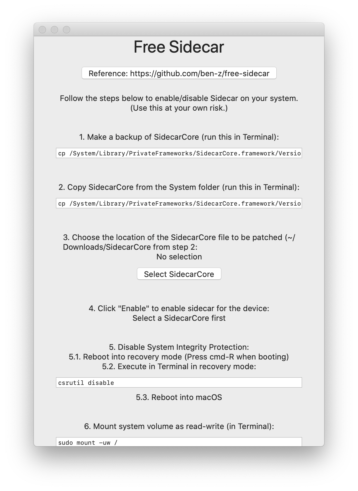
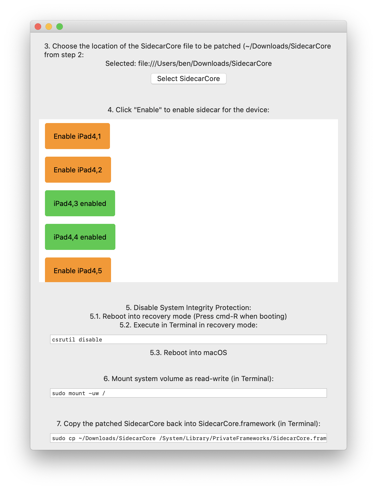

# Free Sidecar

Unlocks [Sidecar](https://support.apple.com/en-ca/HT210380) for older, unsupported iPads and Macs.

This has been tested on Macbook Pro (Early 2015) running macOS 10.15 (19A602) (release version) and iPad Air 2 in wired mode.
Note that wireless mode may not work for all older devices.

[Download Free Sidecar](https://github.com/ben-z/free-sidecar/releases/latest/download/free-sidecar.zip)


### Notes
1. Apple uses a simple "blacklist" on macOS to disable iPadOS 13/macOS Catalina devices from using Sidecar. To work around this, we simply need to edit the blacklist in `/System/Library/PrivateFrameworks/SidecarCore.framework/Versions/A/SidecarCore` (can be done with any hex editor of your choice).
2. This app is a UI for editing `SidecarCore`.
3. This app is sandboxed and does NOT need root access. I've left everything that needs root access for you to execute in the Terminal.
4. The entire process includes 2 restarts into the recovery partition and should take around 5-15 minutes.

### Getting Started

1. Make a backup of SidecarCore (run this in Terminal):

```
cp /System/Library/PrivateFrameworks/SidecarCore.framework/Versions/A/SidecarCore ~/Downloads/SidecarCore.bak
```

2. Copy SidecarCore from the System folder (run this in Terminal)

```
cp /System/Library/PrivateFrameworks/SidecarCore.framework/Versions/A/SidecarCore ~/Downloads
```

3. Open [Free Sidecar](https://github.com/ben-z/free-sidecar/releases) (note that macOS may prevent you from running the app. In that case, open `System Preferences - Security & Privacy - General` and select `Open Anyway`) and choose the location of the SidecarCore file to be patched (~/Downloads/SidecarCore from step 2).



4. Click `Enable` to enable sidecar for the corresponding device. This will modify the `SidecarCore` that you've selected in step 3 (you will be replacing the system `SidecarCore` with this file in step 7):
    - Run `sysctl hw.model` in Terminal to find out your mac model. For iPad model, go [here](https://everymac.com/ultimate-mac-lookup/).


5. Disable System Integrity Protection. This will allow us to mount `/` as read-write and modify `SidecarCore` under the `/System` directory.
    1. Reboot into recovery mode (Press cmd-R when booting)
    2. Execute in Terminal in recovery mode:
    ```
    csrutil disable
    ```
    3. Reboot into macOS

6. Mount system volume as read-write (in Terminal):

```
sudo mount -uw /
```

7. Copy the patched SidecarCore back into SidecarCore.framework (in Terminal):

```
sudo cp ~/Downloads/SidecarCore /System/Library/PrivateFrameworks/SidecarCore.framework/Versions/A/SidecarCore
```

8. Sign the patched SidecarCore (in Terminal):

```
sudo codesign -f -s - /System/Library/PrivateFrameworks/SidecarCore.framework/Versions/A/SidecarCore
```

9. Reboot Into Recovery, re-enable System Integrity Protection:

```
csrutil enable
```

10. Reboot Into macOS, the patched devices should now work in wired mode.

### Troubleshooting

1. "The iPad picture quality is sub-optimal!"

    Try using wired connection. For older Macs without hardware HEVC encoder/decoders, it may need extra bandwidth to transmit the screen.
     
2. "Error 32002"

    This happens on wireless connection for some models. Try using a wire instead. (Some people have reported that wired isn't working either on some older models e.g. [MacbookPro 2012](https://www.reddit.com/r/MacOSBeta/comments/dnxxc7/psa_enable_sidecar_on_older_devices_works_for/f5l64ni?utm_source=share&utm_medium=web2x))
    
3. "None of my apps open anymore, They keep crashing!"
    
    You probably forgot to do step 8. If you can use the Terminal, do steps 5,6 and 8 again. If you can't use the Terminal (it keeps crashing), boot into [single user mode](http://osxdaily.com/2018/10/29/boot-single-user-mode-mac/) and do steps 6 and 8 after doing step 5 in Recovery Mode.
    
4. "My question isn't listed"
    
    Search in [https://github.com/ben-z/free-sidecar/issues](issues) or open a new one! Note that I can only fix things that are specific to Free Sidecar (enable/disable sidecar for certain devices). Most usability issues with Sidecar can only be addressed by Apple.
    
5. "I want to revert to the original `SidecarCore`"
    
    Hope you still have the backup file from step 1! (`~/Downloads/SidecarCore.bak`). Disable System Integrity Protection (step 5), mount the system volume as read-write (step 6) and run the following commands in Terminal:
    
    ```
    sudo cp ~/Downloads/SidecarCore.bak /System/Library/PrivateFrameworks/SidecarCore.framework/Versions/A/SidecarCore
    
    sudo codesign -f -s - /System/Library/PrivateFrameworks/SidecarCore.framework/Versions/A/SidecarCore
    ```
    
    Then re-enable System Integrity Protection (step 9). Your system should be in the same state as before you applied the patch!

### Contributing

Submit PRs and open issues!

### Inspirations

[SidecarPatcher](https://github.com/pookjw/SidecarPatcher) - This replaces a hex string that only exists in beta versions (and apparently some official releases?) (thus does not work for me in the final release). [Free Sidecar](https://github.com/ben-z/free-sidecar/)
 uses partial device model string matching (details [here](https://github.com/ben-z/free-sidecar/blob/1390f561000ccfc6122bcae0b1fff1cd5da3b0f0/free-sidecar/utils.swift#L83-L91)) and should work for future versions of macOS as well.
